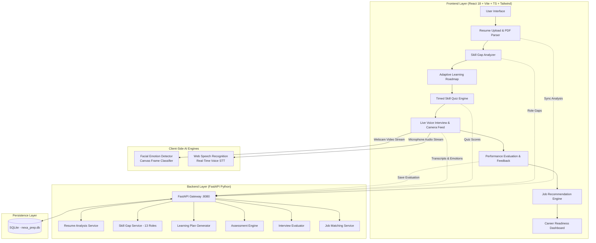
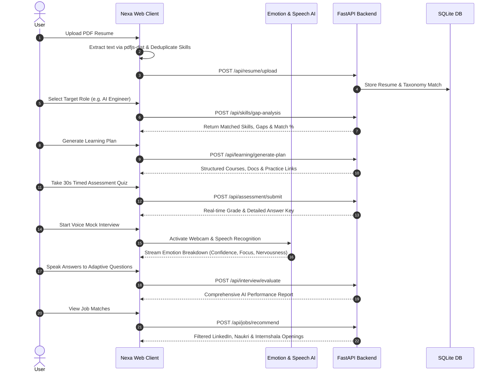

# 🚀 NEXA PREP — AI-Powered Intelligent Career Preparation & Mock Interview Simulation System

**NEXA PREP** is an end-to-end, full-stack AI-driven career preparation platform designed for engineering students and tech job seekers. It guides users through an 8-stage personalized journey—from client-side PDF resume parsing and 13-role skill gap analysis to real-time voice mock interviews with live webcam facial emotion detection and intelligent career readiness scoring.

---

## 🏗️ System Architecture & Workflow



---

## 🔄 User Journey & Feature Flow



---

## 🌟 Core Features

| Step | Feature | Description |
| :--- | :--- | :--- |
| **01** | **Resume Analysis** | Extracts technical skills, frameworks, tools, and education with synonym normalization and zero false positives. |
| **02** | **Skill Gap Detection** | Benchmarks candidate skillset against 13 industry-standard engineering roles with percentage scoring. |
| **03** | **Personalized Learning Plan** | Automatically generates targeted learning roadmaps and curated resources for identified skill gaps. |
| **04** | **Skill Assessment** | 30-second timed quizzes testing conceptual mastery with instant answer explanations. |
| **05** | **Voice Mock Interview** | Real-time voice-driven interview with live webcam facial expression & emotion detection. |
| **06** | **AI Performance Report** | Detailed score cards evaluating answer accuracy, speech clarity, and emotional composure. |
| **07** | **Job Recommendations** | Matches profile with active engineering openings on LinkedIn, Naukri, and Internshala. |
| **08** | **Career Readiness Meter** | Longitudinal progress dashboard tracking interview scores and competency milestones over time. |

---

## 📁 Clean Modular Folder Structure

```text
nexa-prep/
├── frontend/                 # Vite + React 18 + TypeScript Web Application
│   ├── public/               # Static icons, manifest & logos
│   ├── src/                  # Components, pages, hooks, services, context, types, utils
│   │   ├── components/       # UI Components (common, interview, jobs, layout, learning, performance, quiz, resume, skills)
│   │   ├── pages/            # Pages (Home, Resume, Skills, Learning, Quiz, Interview, Performance, Jobs, Progress)
│   │   ├── services/         # Client-side AI & math engines (resumeParser, skillMatcher, quizEngine, etc.)
│   │   ├── context/          # React Context providers (ProgressContext, ResumeContext, AuthContext)
│   │   ├── hooks/            # Custom hooks (useProgress, useInterview, useSkills, etc.)
│   │   ├── types/            # TypeScript schemas & interfaces
│   │   └── utils/            # Deduplication, validators & formatters
│   ├── index.html            # Vite HTML entry point
│   ├── package.json          # Frontend dependencies & npm scripts
│   ├── vite.config.ts        # Vite configuration
│   ├── tsconfig.json         # TypeScript configuration
│   ├── tailwind.config.js    # Tailwind CSS styling configuration
│   └── capacitor.config.json # Mobile build configuration
│
├── backend/                  # FastAPI AI & REST API Service
│   ├── app/                  # Application code
│   │   ├── routes/           # REST endpoints (resume, skill_gap, learning, assessment, interview, job)
│   │   ├── services/         # AI & business logic services (pdf_service, skill_gap_service, etc.)
│   │   ├── models/           # SQLAlchemy database models (nexa_models.py)
│   │   ├── core/             # Configuration & security settings
│   │   ├── database.py       # SQLite engine & session management
│   │   └── main.py           # FastAPI entrypoint & CORS middleware
│   ├── alembic/              # Database migration tracking
│   ├── tests/                # Backend API tests
│   ├── uploads/              # Uploaded document directory
│   ├── requirements.txt      # Python dependencies
│   ├── alembic.ini           # Alembic config
│   └── Dockerfile            # Container definition
│
├── android/                  # Android native Capacitor project
│
├── scripts/                  # Development, test suites & diagnostic scripts
│   ├── data/                 # Test fixtures & sample outputs
│   ├── generate_debug_output.py
│   ├── generate_master_debug.py
│   ├── regression_test.py
│   ├── test_skill_matching.js
│   ├── test_false_positive_matching.cjs
│   ├── test_strict_aliases.py
│   └── test_stt.html
│
├── run.py                    # Unified 1-click launcher (starts Frontend & Backend)
├── .gitignore                # Git ignore rules
├── .env.example              # Environment variables template
└── README.md                 # Project documentation
```

---

## ⚡ Quick Start & Running the Project

### Prerequisites
- **Node.js**: v18.0+ or v20+
- **Python**: v3.10+ or v3.11+
- **npm** or **pnpm**

---

### Option 1: 1-Click Unified Runner (Recommended)
Run both the FastAPI backend and Vite frontend dev server with one command:

```bash
python run.py
```

- **Frontend URL**: [http://localhost:5173](http://localhost:5173)
- **Backend API**: [http://localhost:8080](http://localhost:8080)
- **Interactive Swagger Docs**: [http://localhost:8080/docs](http://localhost:8080/docs)

---

### Option 2: Running Services Separately

#### 1. Start the Frontend
```bash
cd frontend
npm install
npm run dev
```

#### 2. Start the Backend
```bash
cd backend
python -m venv ../venv
../venv/Scripts/activate       # On Windows
pip install -r requirements.txt
uvicorn app.main:app --host 0.0.0.0 --port 8080 --reload
```

---

## 🎯 13 Supported Engineering Domains

1. **AI Engineer** (Deep Learning, NLP, Computer Vision, PyTorch, Transformers, LangChain, LLMs)
2. **Machine Learning Engineer** (Scikit-Learn, Pandas, NumPy, MLOps, Model Deployment)
3. **Data Scientist** (Statistics, Python, R, Predictive Modeling, Exploratory Data Analysis)
4. **Data Analyst** (SQL, PowerBI, Tableau, Excel, Data Visualization)
5. **Full Stack Developer** (React, Node.js, TypeScript, REST API, SQL, Tailwind)
6. **Frontend Developer** (React, TypeScript, CSS3, HTML5, Responsive UI)
7. **Backend Developer** (Python/FastAPI, Node.js, PostgreSQL, Docker, Microservices)
8. **DevOps Engineer** (Docker, Kubernetes, AWS, CI/CD, Terraform, Linux)
9. **Cybersecurity Analyst** (Network Security, Penetration Testing, SIEM, Cryptography)
10. **Cloud Engineer** (AWS, Azure, GCP, Cloud Architecture, Serverless)
11. **Mobile App Developer** (React Native, Flutter, Android, iOS, Swift)
12. **Embedded Systems Engineer** (C, C++, RTOS, Microcontrollers, PCB Design)
13. **Robotics Engineer** (ROS, ROS2, Control Systems, MATLAB, Kinematics)

---

## 🧪 Testing & Validation

```bash
# Run Skill Matching Unit Tests
node scripts/test_skill_matching.js

# Run Python Regression Tests
python scripts/regression_test.py

# Test Production Build
cd frontend && npm run build
```

---

## 📜 License
This project is open source and available under the [MIT License](LICENSE).
